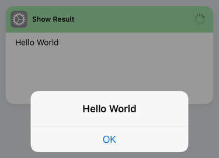

# Splash Documentation and Reference

Splash is in an early stage of development, so it support just a few actions.

To give us some luck, let's begin with a classic Hello World.

```python
ShowResult("Hello World")  # strings can be surrounded by " or '

# This will result in the following shortcut
```



As you can see, comments are preeceeded with the hash `#` character.

## Data Types

### Strings

Strings are a sequence of characters that represent text. You can insert them in the middle of your code by puting the characters inside single or double quotes.


```python
"This is a string"
'This is also a string'
```

But both quotes must be of the same type. This can be useful if you want to have a quote character inside your string.

```python
"String with a single ' quote inside it"
```

The other option you have is to [escape](https://en.wikipedia.org/wiki/Escape_character) the special symbols.

```python
'String with a single \' quote inside it'
```

Strings can also be multiline

```python
'This is the first line
This is the second
This is the third'  # Syntax coloring will not work here, but will work fine in the splash editor.
```

This will result in the following shortcut


#### Ask text from the user

To ask from the user you can use the `AskText()` function

```python
AskText("What's your name?")
```

produces:


### Numbers

To input numbers you just type them.
Here are some examples.