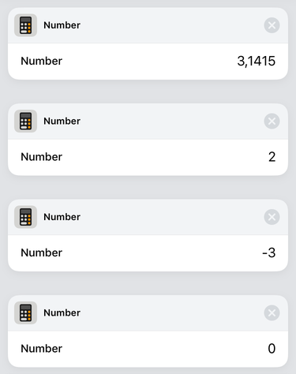
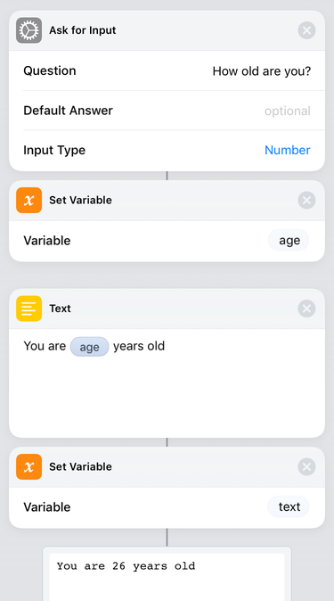
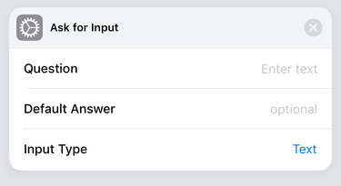
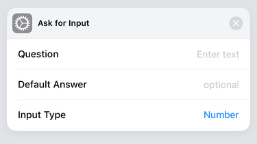
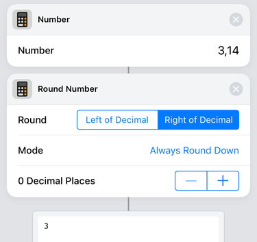
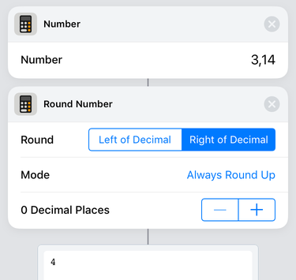
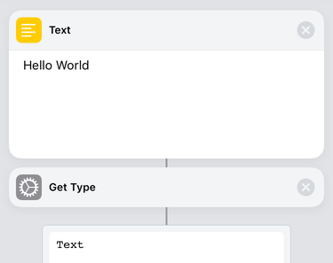

# Splash Documentation and Reference

Jump to the [actions reference](#actions-reference)

## Getting started

Splash is in an early stage of development, so it support just a few actions.

To give us some luck, let's begin with a classic Hello World.

```python
ShowResult("Hello World")  # strings can be surrounded by " or '

# This will result in the following shortcut
```


As you can see, comments are preeceeded with the hash `#` character.

Now let's dive in to data types

## Strings

Strings are a sequence of characters that represent text. You can insert them in the middle of your code by puting the characters inside single or double quotes.


```python
"This is a string"
'This is also a string'
```

But both quotes must be of the same type. This can be useful if you want to have a quote character inside your string.

```python
"String with a single ' quote inside it"
```

The other option you have is to [escape](https://en.wikipedia.org/wiki/Escape_character) the special symbols.

```python
'String with a single \' quote inside it'
```

Strings can also be multiline

```python
'This is the first line
This is the second
This is the third'  # Syntax coloring will not work here, but will work fine in the splash editor.
```

This will result in the following shortcut


### Ask text from the user

To ask from the user you can use the `AskText()` function

```python
AskText("What's your name?")
```

produces:


## Numbers

To input numbers you just type them.
Here are some examples.

```python
3.1415  # always use the . character as decimal separator
2
-3
0
```



You can also perform math operations with numbers

The available operators are:

```python
1 + 2    # sum
3 - 4    # subtraction
5 * 6    # multiplication
7 / 8    # division
9 % 10   #  modulus operation
11 ^ 12  # 11 to the 12th power
```

And you can combine them:

```python
1 + 2 - 3 * 4 / 5 ^ 6  # will result in 2.999232
```

As you can see, operator precedence is respected as usual.

### Ask numbers from the user

To ask a number you can use the `AskNumber()` function

```python
AskNumber("How old are you?")
```

produces:


## Variables

Variable names must start with a letter or a underscore `_` and can only contain `_`, letters and numbers.

```python
# Valid variable names
_foo
foo
bar1
fooBar_123
foo_bar

# Invalid variable names

1foo
foo-bar
```

To assign a value to a variable you can use `:=`

```
name := AskText("What's your name?")
age := AskNumber("How old are you?")
```

produces:


## Interpolated strings

You can put variables inside strings and their content will be embeded in the string.

```python
age := AskNumber("How old are you?")
text := "You are {age} years old"
```

produces:




### Conditionals and flow control

Splash `if else` statements behave like in the most of programming languages.

```
age := AskNumber("How old are you?")

if age < 12 {
    ShowResult("Child")
} else if age < 18 {
    ShowResult("Teen")
} else if age < 60 {
    ShowResult("Adult")
} else {
    ShowResult("Elder")
}
```

You can also have expressions in the middle of your comparisons

```python
year := AskNumber("Enter the year")

if year % 4 > 0 {
    leap := 0
} else if year % 100 > 0 {
    leap := 1
} else if year % 400 > 0 {
    leap := 0
} else {
    leap := 1
}
```

To check for equality you use the `==` symbol

```python
a := AskNumber("a =")
b := AskNumber("b =")
c := AskNumber("c =")

delta := b^2 - 4 * a * c

if delta == 0 {
    ShowResult("Both roots are equal")
} else if delta < 0 {
    ShowResult("No real roots")
} else {
    ShowResult("Equation have two distinct roots")
}
```

At the moment, splash supports `<`, `>` and `==` comparison operators only.

## That's all folks

That covers all the basics of the splash language.
To know more you can read the [Actions Reference](#actions-reference)


# Actions Reference

### `AskText([question])`

You can pass an optional `string` parameter that will be promped to the user.

```python
AskText("What's your name?")
```

produces:


Or you can pass no parameter

```python
AskText()
```

produces:




### `AskNumber([question])`

You can pass an optional `string` parameter that will be promped to the user.

```python
AskNumber("How old are you?")
```

produces:


Or you can pass no parameter

```python
AskNumber()
```

produces:



### `ShowResult(result)`

Shows in an alert the content of result

```python
ShowResult("Hello World")
```

produces:


### `Floor(value)`

Rounds the number down

```python
Floor(3.14)
```

produces:




### `Ceil(value)`

Rounds the number up

```python
Ceil(3.14)
```

produces:



### `Round(value)`

Round to the closest possible return value; when caught halfway between two positive numbers, round up; when caught between two negative numbers, round down.

```python
Round(-3.5)
```

produces:


### `GetName(item)`

```python
GetName("Hello World")
```

produces: 


### `GetType(item)`

```python
GetType("Hello World")
```

produces: 

